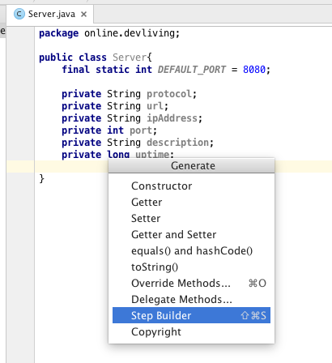
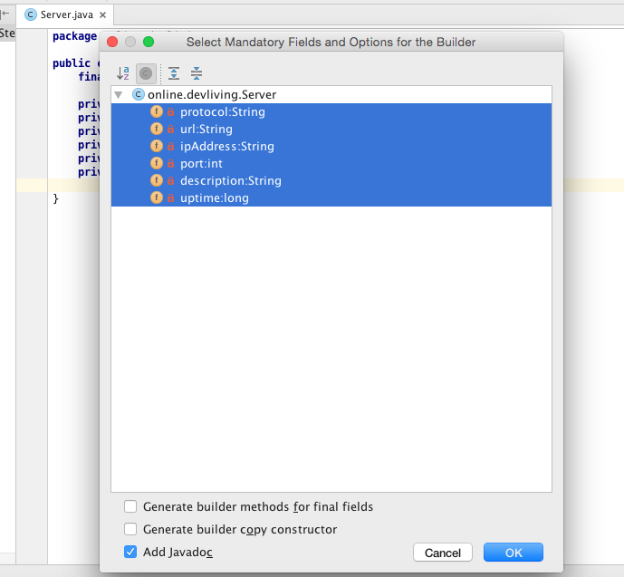

StepBuilder Generator
=======================

[IntelliJ IDEA](http://www.jetbrains.com/idea/)/[Android Studio](http://developer.android.com/tools/studio/index.html)
plugin that adds a 'Step Builder' action to the Generate menu (Alt+Insert)
which generates a Builder class which follows the Step Builder pattern. You can
read about the Step Builder pattern and why it might be a little more effective than
the usual Builder pattern [here](http://devliving.online/stepbuilder-builder-that-guides-you-through-the-steps/).




```java
public class Server{
    final static int DEFAULT_PORT = 8080;

    private String protocol;
    private String url;
    private String ipAddress;
    private int port;
    private String description;
    private long uptime;

    private Server(Builder builder) {
        this.protocol = builder.protocol;
        this.url = builder.url;
        this.ipAddress = builder.ipAddress;
        this.port = builder.port;
        this.description = builder.description;
        this.uptime = builder.uptime;
    }

    public static IProtocol builder() {
        return new Builder();
    }


    public interface IBuild {
        Server build();
    }

    public interface IUptime {
        IBuild uptime(long uptime);
    }

    public interface IDescription {
        IUptime description(String description);
    }

    public interface IPort {
        IDescription port(int port);
    }

    public interface IIpAddress {
        IPort ipAddress(String ipAddress);
    }

    public interface IUrl {
        IIpAddress url(String url);
    }

    public interface IProtocol {
        IUrl withProtocol(String val);
    }

    public static final class Builder implements IUptime, IDescription, IPort, IIpAddress, IUrl, IProtocol, IBuild {
        private long uptime;
        private String description;
        private int port;
        private String ipAddress;
        private String url;
        private String protocol;

        private Builder() {
        }

        @Override
        public IBuild uptime(long uptime) {
            this.uptime = val;
            return this;
        }

        @Override
        public IUptime description(String description) {
            this.description = val;
            return this;
        }

        @Override
        public IDescription port(int port) {
            this.port = val;
            return this;
        }

        @Override
        public IPort ipAddress(String ipAddress) {
            this.ipAddress = val;
            return this;
        }

        @Override
        public IIpAddress url(String url) {
            this.url = val;
            return this;
        }

        @Override
        public IUrl protocol(String protocol) {
            this.protocol = val;
            return this;
        }

        public Server build() {
            return new Server(this);
        }
    }
}
```

### Installation

In IntelliJ IDEA 12.x or later, go to `File` > `Settings` > `Plugins` or
 `Intellij IDEA` > `Preferences` > `Plugins` on Mac OSx. Click the `Browse repositories` button, in
the search field, type `online.devliving.stepbuilder.generator` or `Step Builder Generator`.
It should show up in the plugin list. Right-click it and select `Download and Install`.

#### Manual installation

Download the plugin jar `stepbuilder.jar` and select "Install Plugin From Disk" in IntelliJ's plugin preferences.

### Usage

Use `Shift+Ctrl+S` or `Alt+Insert` and select `Step Builder`. Choose the mandatory fields
(the fields that must be set for an object of this class) and press `OK`.

### Rate

If you enjoy this plugin, please rate it on it's [plugins.jetbrains.com page](http://plugins.jetbrains.com/plugin/8276).

### License

Licensed under the [Apache License, Version 2.0](http://www.apache.org/licenses/LICENSE-2.0).

The source code is based on the code from the [innerbuilder plugin](https://github.com/analytically/innerbuilder).

© [Mehedi Hasan Khan](http://devliving.online/)